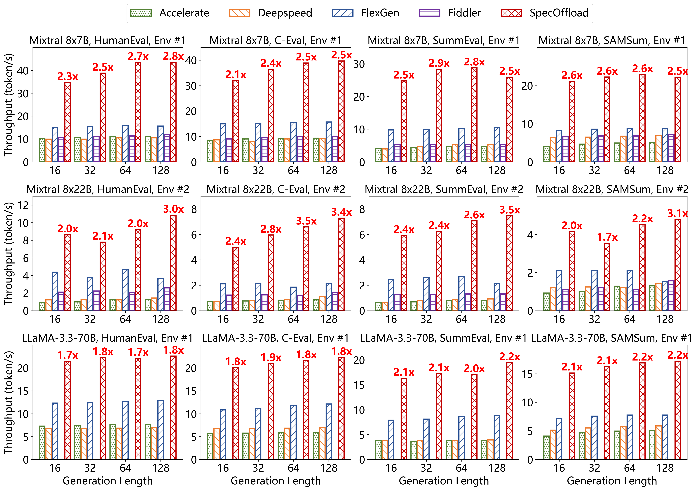

# SpecOffload: Unlocking Latent GPU Capacity for LLM Inference on Resource-Constrained Devices

SpecOffload is an efficient offloading
framework for high-throughput inference on resource-constrained devices. It allows you to run unquantized Mixtral-8x7B model (>90GB of parameters) with >30 token/s on a single 24GB GPU.


## Prepare

### Get the Code
```bash
cd <path/to/SpecOffload>
# install pytorch
pip install torch==2.5.1 torchvision==0.20.1 torchaudio==2.5.1 --index-url https://download.pytorch.org/whl/cu121
# install SpecOffload
pip install -e .
# install dependencies
pip install -r requirements.txt
```

### Model Download
Target model: [Mixtral 8x7B](https://huggingface.co/mistralai/Mixtral-8x7B-v0.1), [Mixtral 8x22B](https://huggingface.co/mistralai/Mixtral-8x22B-v0.1). Draft model: [Mistral 7B](https://huggingface.co/mistralai/Mistral-7B-Instruct-v0.2).
> We recommend using huggingface-cli to download the whole model repo.

## Usage

```bash
# use romeo-and-juliet e-book as input
python examples/run.py --target-model <path/to/target/model> --draft-model <path/to/draft/model> --input-token-length-truncate 128 --cuda 0

# use HumanEval (need download) as input,see more details in ./benchmarks
python examples/run.py --target-model <path/to/target/model> --draft-model <path/to/draft/model> --dataset openai_humaneval --cuda 1
```

You can check the detailed results in `log.txt`.

## Key Idea
The key idea of SpecOffload is to leverage the underutilized GPU resources in existing offloading methods.

### Motivation: GPU resources underutilized

<div style="display: flex; gap: 10px;">
  
  
</div>

* **Underutilization of GPU cores.**
During the decoding phase, the average GPU core utilization of existing methods is only 13% at most.

* **Marginal utility of GPU memory.**
When GPU memory usage for 8x7B models decreased from 22.67GB to 4.20GB, throughput diminished by merely 13%; similarly, for 8x22B models, GPU memory consumption reduction from 20.65GB to 7.15GB resulted in only a 5% throughput decline.(FlexGen) 


### Our proposal: Embedding Speculatice Decoding into Offloading


Schematic of the decoding pipeline. At model-level, while the target model validates Batch 1, the draft model concurrently generates tokens for Batch 0 (in time slot $t_n$); the two models then alternate batches (in time slot $t_{n+1}$). At computation-level, the target model's parameters are computed layer by layer. GPU, IO, and CPU are orchestrated to perform distinct, parallelized tasks. 


> Detail please refer to paper.

## Evaluation


The figure above illustrates the end-to-end throughput of five approaches across two environments and three datasets. Using the Mixtral 8×7B model, SpecOffload attains an average speedup of 2.53× over the strongest baseline, FlexGen; with the Mixtral 8×22B model, it achieves an average speedup of 2.54×.

## Citation
If you use SpecOffload in your research, please cite the following paper.

```
@misc{zhuge2025specoffloadunlockinglatentgpu,
      title={SpecOffload: Unlocking Latent GPU Capacity for LLM Inference on Resource-Constrained Devices}, 
      author={Xiangwen Zhuge and Xu Shen and Zeyu Wang and Fan Dang and Xuan Ding and Danyang Li and Yahui Han and Tianxiang Hao and Zheng Yang},
      year={2025},
      eprint={2505.10259},
      archivePrefix={arXiv},
      primaryClass={cs.LG},
      url={https://arxiv.org/abs/2505.10259}, 
}
```